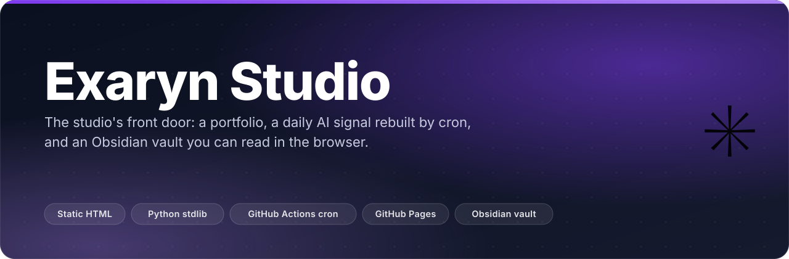
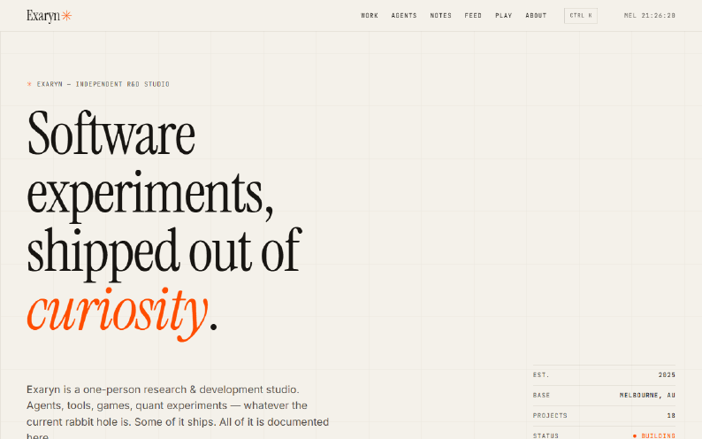
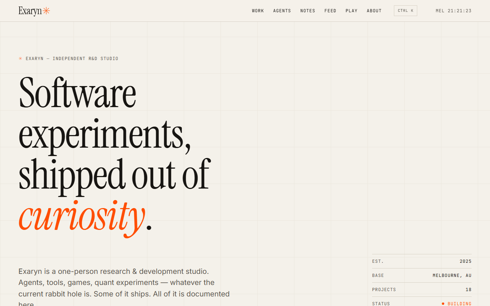
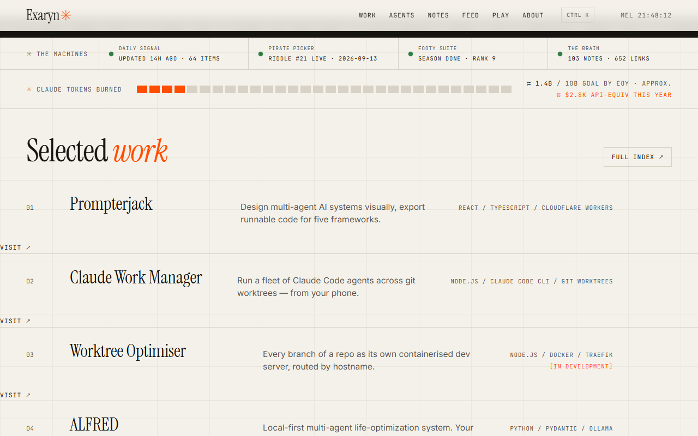
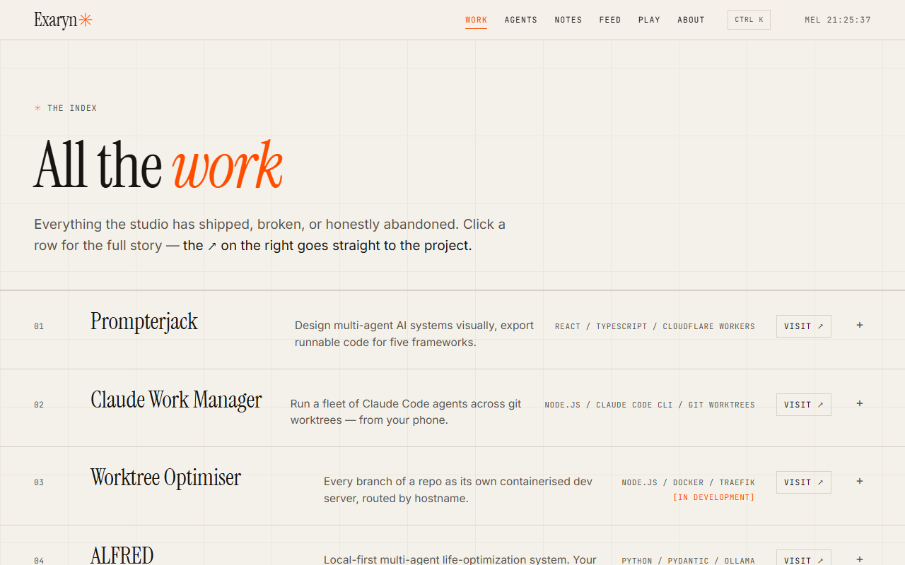
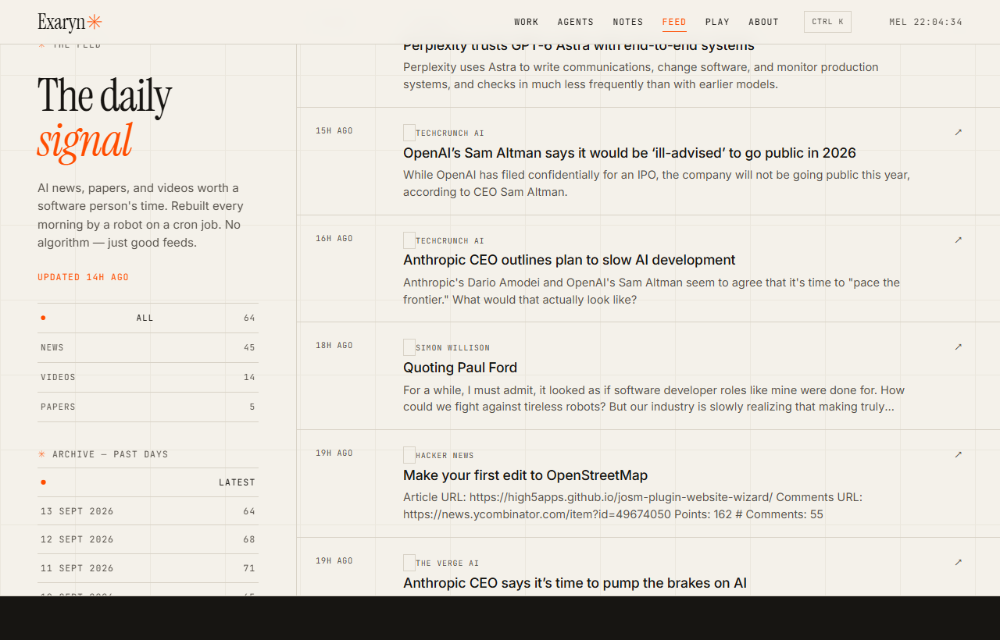
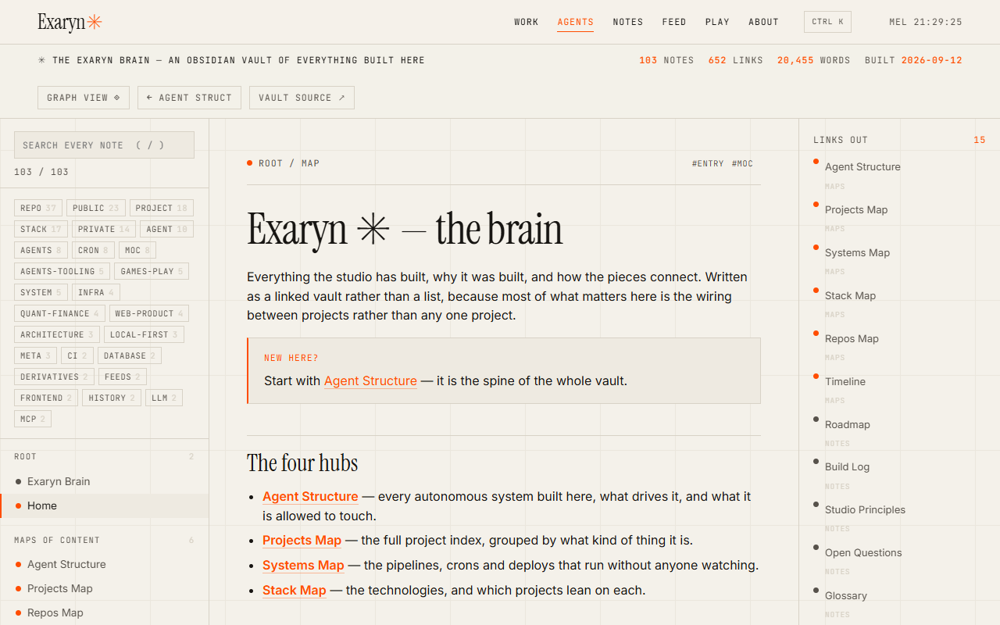
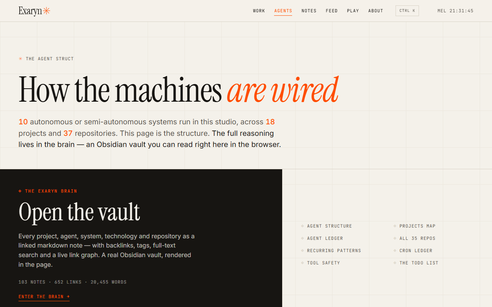
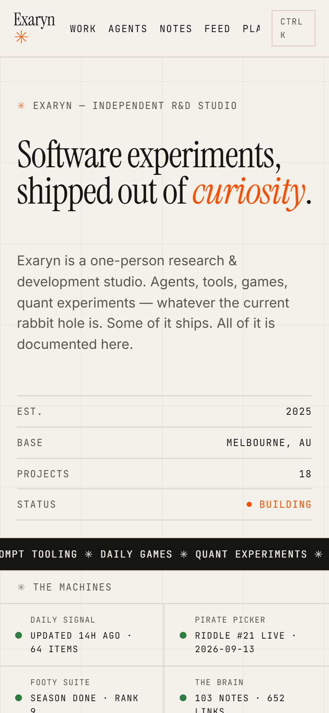
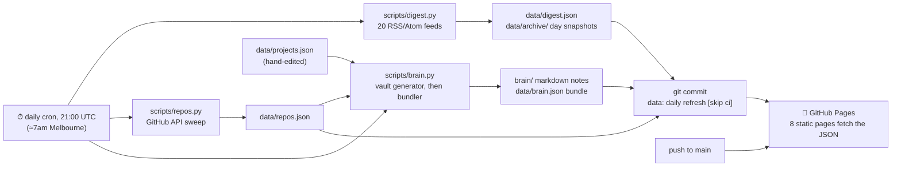

<p align="center"></p>

<p align="center">
  <b>The front door of a one-person R&amp;D studio — and a website that rewrites itself every morning before anyone reads it.</b>
</p>

<p align="center">
  <a href="https://chinmaygit8765.github.io/exaryn-studio/"></a>
  <a href="https://github.com/ChinmayGit8765/exaryn-studio/actions/workflows/site.yml"></a>
  
  
  <a href="https://github.com/ChinmayGit8765/exaryn-studio/commits/main"></a>
  <a href="https://github.com/ChinmayGit8765/exaryn-studio/stargazers"></a>
</p>

---

## ✨ What it does

- **A portfolio index** — 18 projects from `data/projects.json`, each row expanding into architecture, highlights and the one lesson it taught.
- **The Daily Signal** — 20 RSS/Atom feeds (news, arXiv, YouTube) pulled by a stdlib-Python script on a 21:00 UTC cron, deduped, capped at 100 items, filed to `data/digest.json` **and** snapshotted into a per-day archive (28 days on file at the last sweep).
- **The Exaryn Brain** — a real Obsidian vault of **103 notes / 652 links / 20,455 words**, committed as plain `.md` and rendered in the browser with backlinks, tags, full-text search and a live link graph.
- **Live telemetry on the landing page** — each self-updating machine (signal, pirate picker, footy suite, brain) reports its own freshness, next to a token meter driven by `data/stats.json`.
- **Field notes and screening room** — 5 long-form essays under `notes/`, plus 3 subtitled ~70-second product walkthroughs under `demos/`.
- **No framework, no build step, no dependencies.** Eight static HTML pages, one stylesheet, three vanilla JS files, three stdlib Python scripts. Everything the backend does ends as a diffable commit.

## 🎬 See it

<p align="center"></p>
<p align="center"><sub>The landing page, top to bottom — <a href="https://chinmaygit8765.github.io/exaryn-studio/">chinmaygit8765.github.io/exaryn-studio</a></sub></p>

<table><tr>
<td width="50%"><br><sub><b>index.html</b> — the hero, with a live Melbourne clock and the project count read from <code>projects.json</code></sub></td>
<td width="50%"><br><sub><b>The machines</b> — every self-updating system reports its own freshness; below it, the token meter and selected work</sub></td>
</tr><tr>
<td width="50%"><br><sub><b>projects.html</b> — the full index; click a row for architecture, highlights and lessons</sub></td>
<td width="50%"><br><sub><b>feed.html</b> — filters by kind, an archive of past days, and what the cron pulled this morning</sub></td>
</tr><tr>
<td width="50%"><br><sub><b>brain.html</b> — the Obsidian vault in the page: tree, tag cloud, backlinks, search, graph</sub></td>
<td width="50%"><br><sub><b>agents.html</b> — the agent struct, sorted by how much supervision each system needs</sub></td>
</tr></table>

<p align="center"><br><sub>390 × 844 — the grid, marquee and machine strip reflow to one column</sub></p>

## 🧠 How it works

There is no server. A cron fires, three stdlib-Python scripts rewrite JSON in `data/`, the bot
commits whatever changed with `[skip ci]`, and GitHub Pages redeploys the folder as-is.



Walk-through:

1. **`digest.py`** hits 20 feeds in an 8-thread pool — 10 news/blogs, 2 arXiv categories, 8 YouTube channels. Per source it keeps 6 news / 3 videos / 5 papers within a 7-, 21- and 7-day freshness window, dedupes by URL, sorts newest-first and truncates to 100. A dead feed logs `FAIL` and is skipped; only *every* feed failing exits non-zero.
2. **`repos.py`** sweeps every repository on the account — language breakdown, topics, licence, sizes, timestamps, a README blurb — into `data/repos.json`. In CI it is `continue-on-error`, so a rate-limited sweep leaves yesterday's metadata standing rather than blanking it.
3. **`brain.py`** regenerates the vault's derived notes from `projects.json` + `repos.json`, then bundles all 103 notes into `data/brain.json` with wikilinks resolved and backlinks computed.
4. **The workflow** only regenerates on `schedule`/`workflow_dispatch`; a plain push deploys the tree as-is. Both paths end at `actions/deploy-pages`.
5. **The pages** are dumb on purpose: each one `fetch()`es the JSON it needs and renders it client-side. That is why opening `index.html` off disk shows an empty page — see Quick start.

## 🚀 Quick start

```sh
npm run dev            # npx serve -l 3000 . — no install step
# open http://localhost:3000
```

`python -m http.server 8080` works just as well. What does *not* work is opening
`index.html` straight from disk: `fetch()` needs `http://`, so the data never loads.

Regenerate the generated data (Python 3, no pip install needed):

```sh
npm run digest    # data/digest.json + data/archive/<date>.json  — the daily signal
npm run repos     # data/repos.json    — GitHub metadata sweep (needs network)
npm run brain     # brain/** + data/brain.json — the vault and its bundle
npm run build     # all three, in order
```

## 🗂️ Project layout

```
index.html          landing — hero, live machines, token meter, work, brain, notes, demos, feed
projects.html       full project index + the roadmap lanes
agents.html         the agent struct — tiers, shared rules, everything built
brain.html          the Obsidian vault, rendered in the browser
feed.html           full daily signal with filters and the archive
notes.html          field-note index · notes/*.html  5 essays
play.html           One Piece Guess, embedded · about.html  the human bit
demos/              3 subtitled ~70s product walkthroughs

assets/style.css    design system — paper, hairlines, serif, one accent
assets/app.js       projects, digest, token meter, machines, ⌘K palette (page-aware)
assets/agents.js    the agent struct page      assets/brain.js  markdown + graph renderer

brain/              THE VAULT — real .md files, open the folder in Obsidian
data/projects.json  the portfolio — edit this to add or update a project
data/*.json         generated: repos · brain · digest (+ archive/) — don't hand-edit
scripts/*.py        digest · repos · brain — stdlib only
.github/workflows/  site.yml — daily cron, data commit, Pages deploy
```

## 🧰 Stack

| Layer | Choice | Why |
|---|---|---|
| Pages | Hand-written HTML × 8 | Nothing to build means nothing to break; view-source is the documentation |
| Styling | One `style.css`, no preprocessor | Paper ground, hairline grid, serif display, a single accent |
| Client JS | Vanilla ES, three files, no bundler | Each page `fetch()`es its own JSON; zero dependencies to audit |
| Data | JSON files in `data/`, committed | Every refresh is a diff you can bisect and roll back |
| Generators | Python 3 **stdlib only** | CI needs no `pip install`; `urllib` + `ElementTree` is enough for RSS |
| Knowledge base | A real Obsidian vault in `brain/` | Notes stay useful locally *and* render in the browser from one bundle |
| Schedule | GitHub Actions cron, 21:00 UTC | The whole backend, for free, with an audit trail in `git log` |
| Hosting | GitHub Pages via `deploy-pages` | Static, no server to keep alive, no bill when nobody visits |

## 🧩 The work it showcases

Every project lives in [the index](https://chinmaygit8765.github.io/exaryn-studio/projects.html);
these are the flagships with public source.

| Project | What it is | Source | Live |
|---|---|---|---|
| **Claude Work Manager** | A fleet of Claude Code agents across git worktrees, driven from your phone | [`claude-work-manager`](https://github.com/ChinmayGit8765/claude-work-manager) | — |
| **Worktree Optimiser** | Every branch of a repo as its own containerised dev server, routed by hostname | [`worktree-optimiser`](https://github.com/ChinmayGit8765/worktree-optimiser) | — |
| **ALFRED** | Local-first multi-agent life-optimisation system | [`AlfredOpenSource`](https://github.com/ChinmayGit8765/AlfredOpenSource) | — |
| **QuantFlex** | Derivatives pricing and risk engine — hand-rolled Monte Carlo, triple-verified Greeks | [`quantflex`](https://github.com/ChinmayGit8765/quantflex) | [site](https://chinmaygit8765.github.io/quantflex-site/) |
| **QuantLens** | AI-augmented portfolio and market-intelligence dashboard | [`FinancialServicesDashboard`](https://github.com/ChinmayGit8765/FinancialServicesDashboard) | — |
| **VolForecast** | Volatility modelling and forecasting | [`VolatilityModel`](https://github.com/ChinmayGit8765/VolatilityModel) | — |
| **holdem-ml** | Texas Hold'em against bots trained from scratch, hand-written NN | [`holdem-ml`](https://github.com/ChinmayGit8765/holdem-ml) | — |
| **One Piece Guess** | Wordle, but for One Piece — a new pirate every morning, picked by a cron | [`one-piece-guess-game`](https://github.com/ChinmayGit8765/one-piece-guess-game) | [play](https://chinmaygit8765.github.io/one-piece-guess-game/) |
| **Side by Side** | A self-updating Collingwood super-fan suite — reskin it for your club | [`collingwood-fan-suite`](https://github.com/ChinmayGit8765/collingwood-fan-suite) | [site](https://chinmaygit8765.github.io/collingwood-fan-suite/) |
| **Solo Strength Quest** | A fitness RPG: every workout is a quest | [`strength-quest`](https://github.com/ChinmayGit8765/strength-quest) | [demo](https://chinmaygit8765.github.io/solo-strength-quest-play/) |
| **smartc** | CLI that scaffolds Rust/Solidity smart contracts | [`SmartContract-Creator`](https://github.com/ChinmayGit8765/SmartContract-Creator) | — |
| **Contact Flow** | A production-shaped contact/lead-capture stack | [`ContactUsPage`](https://github.com/ChinmayGit8765/ContactUsPage) | — |
| **TODO List** | A deliberately simple todo app built like a real codebase | [`TODO-list`](https://github.com/ChinmayGit8765/TODO-list) | — |

**Prompterjack** — visual multi-agent AI system design, exporting runnable code for five
frameworks — is the studio's flagship but its source is private; the product lives at
[prompterjack.com](https://prompterjack.com).

## 📓 The Exaryn Brain

`brain/` is a real [Obsidian](https://obsidian.md) vault — plain `.md` files with YAML
frontmatter and `[[wikilinks]]`, no plugins required. Two ways to read it:

- **In Obsidian** — *Open folder as vault* → pick `brain/`. Graph, backlinks and search work out of the box.
- **In the browser** — [`brain.html`](https://chinmaygit8765.github.io/exaryn-studio/brain.html), linked from the **Agents** tab. Same notes, rendered from `data/brain.json`.

Start at [`brain/Home.md`](brain/Home.md). The hub everything hangs off is
[`brain/maps/Agent Structure.md`](brain/maps/Agent%20Structure.md), the pipelines are written up
under [`brain/systems/`](brain/systems), and the studio's todo list is
[`brain/notes/Roadmap.md`](brain/notes/Roadmap.md).

| Folder | Notes | Folder | Notes |
|---|---:|---|---:|
| `brain/repos/` | 37 | `brain/stack/` | 16 |
| `brain/projects/` | 18 | `brain/maps/` | 6 |
| `brain/agents/` | 14 | `brain/notes/` | 5 |
| `brain/systems/` | 5 | root | 2 |

<details>
<summary><b>Hand-written vs generated notes</b></summary>

Notes under `brain/projects/` and `brain/repos/`, plus `Projects Map`, `Repos Map`, `Timeline`
and `Agent Ledger`, carry `generated: true` and are rewritten by `scripts/brain.py` from
`data/projects.json` and `data/repos.json` — **do not edit those by hand.** Everything else is
hand-written; edit it in Obsidian and run `npm run brain` to publish it.

</details>

<details>
<summary><b>Adding a note</b></summary>

Drop a `.md` file anywhere under `brain/` with frontmatter:

```markdown
---
title: My Note
type: note          # note | map | agent | system | stack | project | repo
tags: [practice, agents]
aliases: [Another Name]
---

# My Note

Body text, with [[Home]] and [[Agent Structure]] wikilinks.
```

Then `npm run brain`. The bundler resolves the links, computes backlinks, and the note appears
in the browser view and the graph. `type` decides its colour; `aliases` let other notes link to
it by any of those names.

An `agents/` note with `type: agent` and a `tier:` of 1, 2 or 3 also shows up automatically on
`agents.html` and in the Agent Ledger.

</details>

<details>
<summary><b>Adding a project</b></summary>

Append an object to [`data/projects.json`](data/projects.json):

```json
{
  "name": "Thing",
  "slug": "thing",
  "tagline": "One line on what it does.",
  "description": "A paragraph for the expanded row and the brain note.",
  "tech": ["TypeScript", "Postgres"],
  "status": "shipped",
  "year": "2026",
  "devTime": "~2 weeks",
  "category": "Web & Product",
  "repo": "ChinmayGit8765/thing",
  "agents": ["Some Agent Note"],
  "architecture": "How it's put together, in two or three sentences.",
  "highlights": ["What's actually in it", "One bullet each"],
  "lessons": "The one thing it taught.",
  "links": { "live": "https://…", "repo": "https://github.com/…" }
}
```

`name`, `tagline`, `tech`, `status`, `year` and `links` drive the site index; everything else
enriches the generated brain note. Run `npm run brain` after editing.

</details>

<details>
<summary><b>Tuning the digest</b></summary>

Edit the `FEEDS` list in [`scripts/digest.py`](scripts/digest.py). Any RSS or Atom URL works;
YouTube channels use `https://www.youtube.com/feeds/videos.xml?channel_id=…` (the channel ID is
on the channel page → About → Share → Copy channel ID). The caps and freshness windows are the
constants right below the list:

| Constant | news | video | paper |
|---|---:|---:|---:|
| `MAX_PER_SOURCE` | 6 | 3 | 5 |
| `MAX_AGE_DAYS` | 7 | 21 | 7 |

`MAX_TOTAL` caps the whole digest at 100 items. A feed that dies just logs a warning — it never
breaks the build. Each run also writes `data/archive/<Melbourne date>.json` and rebuilds
`data/archive/index.json`, which is what the feed page's archive rail reads.

</details>

<details>
<summary><b>The repo sweep and private repositories</b></summary>

[`scripts/repos.py`](scripts/repos.py) pulls every repository on the account into
[`data/repos.json`](data/repos.json) — language breakdown, topics, licence, sizes, timestamps
and a README blurb. It runs unauthenticated against the public search API, so it works out of
the box in CI. To include **private** repositories, add a personal access token with `repo`
scope as a repository secret and pass it as `GH_PAT` in the workflow. Repos already recorded as
private are kept across a run that cannot see them, so a sweep without a PAT never deletes them.

</details>

<details>
<summary><b>Deploying your own copy</b></summary>

1. Create a GitHub repo and push this to `main`.
2. Repo **Settings → Pages → Source: GitHub Actions**.
3. Done. Every push deploys; every morning (~7am Melbourne) the cron refreshes the digest,
   sweeps repo metadata, rebuilds the brain, commits whatever changed, and redeploys.

The workflow needs `contents: write` (for the data commit) plus `pages: write` and
`id-token: write` — see [`.github/workflows/site.yml`](.github/workflows/site.yml).

</details>

## 🗺️ Status & roadmap

The studio's live roadmap is the site itself — [the roadmap lanes on
`projects.html`](https://chinmaygit8765.github.io/exaryn-studio/projects.html) and
[`brain/notes/Roadmap.md`](brain/notes/Roadmap.md), both kept current by hand.

- ✅ Eight static pages, deployed to GitHub Pages by Actions on every push
- ✅ Daily signal on a 21:00 UTC cron, 20 feeds, per-day archive
- ✅ The brain: 103 notes bundled for the browser with backlinks, tags, search and a graph
- ✅ Agent struct page generated from the vault's `type: agent` notes
- ✅ Field notes (5 essays) and the screening room (3 walkthroughs)
- 🚧 `data/stats.json` — the token meter is hand-updated, not measured
- 🔜 More essays, more walkthroughs, and whatever the next rabbit hole turns out to be

## 📄 License

No `LICENSE` file in the repo, so all rights are reserved by default — the `brain/` vault is published to be read, not relicensed. Ask if you want to reuse something.

<p align="center"><sub>Built by <a href="https://github.com/ChinmayGit8765">Chinmay</a> · part of the <a href="https://chinmaygit8765.github.io/exaryn-studio/">Exaryn</a> studio</sub></p>
